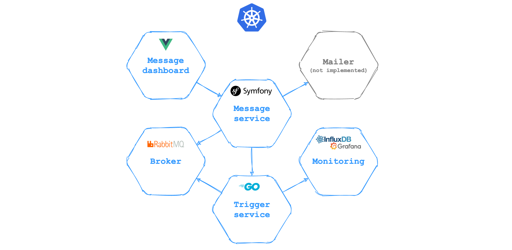

## Демонстрация работы [Trigger Hook](https://github.com/pvelx/triggerhook).  

Приложение разворачивается при помощи Kubernetes.

<br/>




- **[Admin Dashboard](https://github.com/pvelx/message-dashboard-demo)** - панель администратора для доступа к API сервиса Message. Интерфейс построен на базе фреймворка Vue.
- **[Message service](https://github.com/pvelx/message-service-demo)** - отвечает за управление сообщениями. Создание, удаление, отложенная отправка. Написан на базе фреймворка Symfony 5 (PHP).
- **Broker** - брокер сообщений RabbitMQ для асинхронного взаимодействия.
- **Monitoring** - мониторинг сервиса Trigger. Отображаемые метрики описаны [тут](https://github.com/pvelx/triggerhook#%D0%BF%D1%80%D0%B8%D0%BD%D1%86%D0%B8%D0%BF-%D1%80%D0%B0%D0%B1%D0%BE%D1%82%D1%8B). Построен на базе InfluxDb + Grafana.
- **[Trigger service](https://github.com/pvelx/trigger-service-demo)** - сервис реализует механизм отложенного выполенения задач. Построен на безе [Trigger Hook](https://github.com/pvelx/triggerhook).

<br/>

---

### Локальное развертывание
#### Предварительные требования
Прежде всего должны быть установлены следующие приложения:
- docker
- kubectl
- minikube
- git

Для MacOs в качесве драйвера лучше дополнительно установить virtualbox или parallels. Docker в качестве драйвера на данной системе может работать медленно. 

<br/>

#### Запуск
Вы можете использовать не стандартный драйвер, например, virtualbox или parallels.
```bash
minikube start
```
или
```bash
minikube start --vm-driver=parallels
```

<br/>

Клонирование репозиториев проекта:
```bash
mkdir trigger-hook-demo && cd trigger-hook-demo

git clone https://github.com/pvelx/k8s-message-demo.git

cd k8s-message-demo && ./download
```

<br/>

Развертывание на виртуальной машине:
```bash
./deploy
```

Может быть потрачено около 10 мин на скачивание образов контейнеров и их запуск прежде чем, приложение полностью заработает.

<br/>

Для доступа сервисам с локальной машины нужно выполнить:
```bash
./update_hosts
```
С развернутого хоста станут доступны сервисы по ссылкам:
- [dashboard.message.com](http://dashboard.message.com)
- [api.message.com](http://api.message.com)
- [monitoring.message.com](http://monitoring.message.com/d/yw-A1jaMk/task-service)
- [rabbitmq.message.com](http://rabbitmq.message.com)  
    login:rabbitmq  
    password:secret

<br/>

Открытие приборной панели Kubernetes:
```bash
minikube dashboard
```

<br/>

#### Пересборка сервисов
После изменений кода в одном из сервисов нужно будет его пересобрать:

```bash
./build trigger-service
```

```bash
./build message-service
```

```bash
./build message-dashboard
```

<br/>

#### Удаление
Для удаления сервисов из виртуальной машины можно использовать:
```bash
./undeploy
```

<br/>

Для полного удаления:
```bash
minikube stop
minikube delete
```


### License

This project is licensed under the MIT License - see the [LICENSE](LICENSE) file for details
